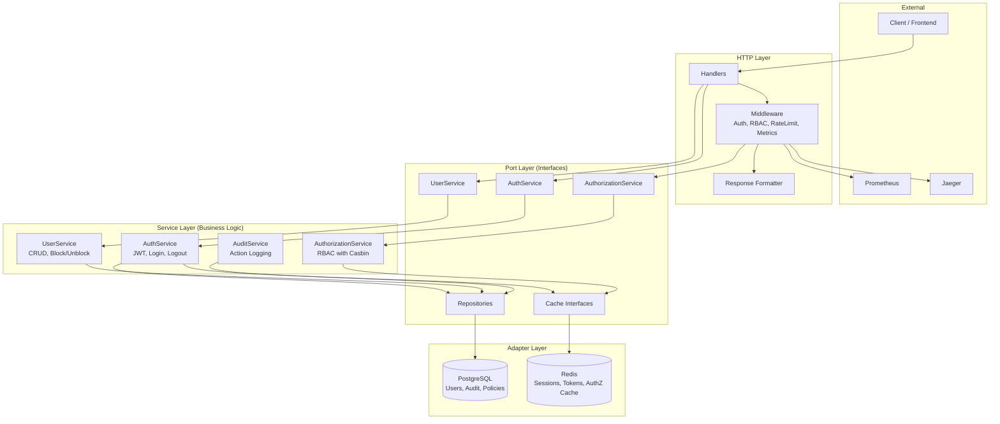
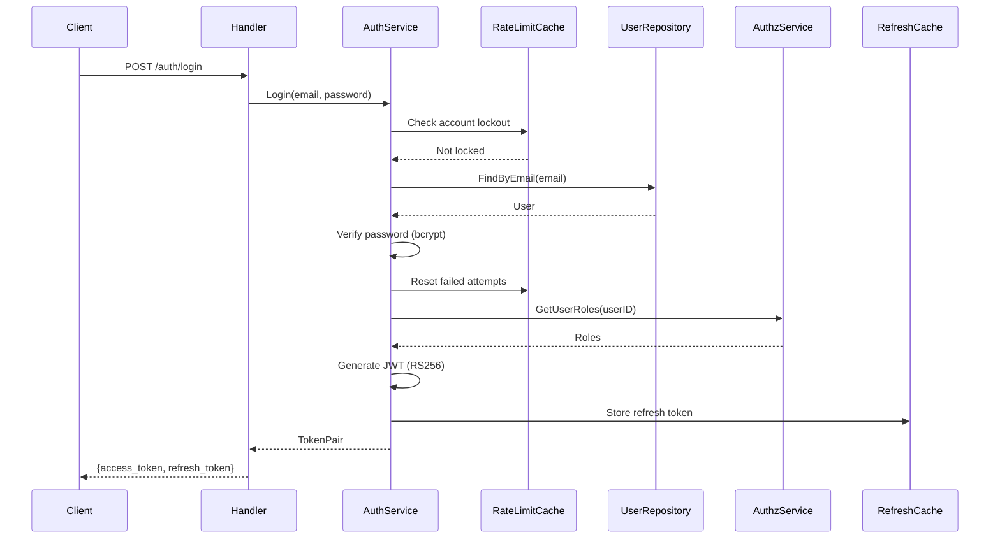
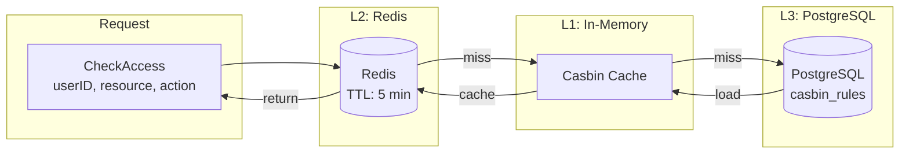
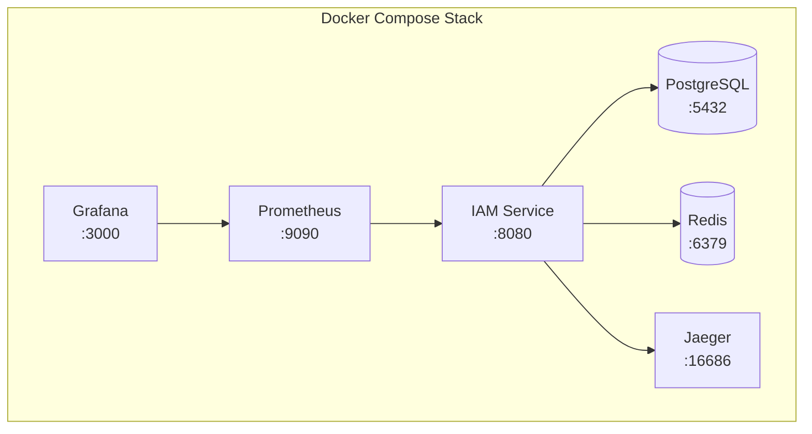

# 🔐 IAM Service

**Identity and Access Management Service** — production-ready микросервис для аутентификации и авторизации, написанный на Go с применением принципов Clean Architecture.

[](https://go.dev/)
[](LICENSE)
[](https://github.com/andrewhigh08/iam-service/actions/workflows/ci.yml)

---

## 📋 Содержание

- [Возможности](#-возможности)
- [Архитектура](#-архитектура)
- [Технологический стек](#-технологический-стек)
- [Быстрый старт](#-быстрый-старт)
- [API документация](#-api-документация)
- [Конфигурация](#-конфигурация)
- [Разработка](#-разработка)
- [Тестирование](#-тестирование)
- [Деплой](#-деплой)
- [Мониторинг](#-мониторинг)

---

## ✨ Возможности

### Аутентификация
- 🔑 **JWT RS256** — асимметричное шифрование токенов с файловыми RSA ключами
- 🔄 **Refresh Tokens** — обновление access токенов без повторного ввода пароля
- 🔒 **Временные пароли** — принудительная смена пароля при первом входе
- 🛡️ **Bcrypt хэширование** — защита паролей с адаптивным cost factor
- 🚪 **Logout** — выход с одного или всех устройств (отзыв refresh токенов)
- 🚫 **Token Blacklist** — немедленный отзыв access токенов при logout
- ⏰ **Password Expiration** — срок действия паролей с принудительной сменой (настраиваемый)
- 🔐 **Account Lockout** — временная блокировка после N неудачных попыток входа
- 📱 **Session Management** — просмотр и отзыв активных сессий пользователя

### Авторизация
- 👥 **RBAC на базе Casbin** — гибкая ролевая модель доступа
- ⚡ **3-уровневое кэширование** — Memory → Redis → PostgreSQL
- 📜 **Политики доступа** — декларативное описание прав в конфигурации
- 🎯 **Middleware интеграция** — прозрачная проверка прав в HTTP handlers

### Управление пользователями
- 👤 **CRUD операции** — полный набор операций над пользователями
- 🚫 **Блокировка/разблокировка** — управление доступом пользователей
- 📊 **Пагинация и фильтрация** — эффективная работа с большими списками
- 📝 **Аудит действий** — полное логирование (login, logout, failed attempts, password changes)

### Безопасность
- 🚦 **Rate Limiting** — защита от brute-force атак (100 req/s глобально, 5 login/min)
- 🛡️ **Security Headers** — XSS, CSRF, Clickjacking protection
- 🌐 **CORS** — настраиваемая политика кросс-доменных запросов
- ✅ **Input Validation** — валидация всех входных данных
- 🔒 **Trusted Proxies** — защита от IP-спуфинга через X-Forwarded-For
- 🔐 **Password Complexity** — строгая валидация паролей (мин. 8 символов, верхний/нижний регистр, цифры, спецсимволы)

### Отказоустойчивость
- 🔌 **Circuit Breaker** — защита от каскадных сбоев (PostgreSQL, Redis)
- ⚡ **Graceful Degradation** — продолжение работы при отказе кэша
- 🔄 **Автоматическое восстановление** — проверка доступности сервисов (half-open state)

### Observability
- 📈 **Prometheus метрики** — HTTP, авторизация, кэш, бизнес-метрики
- 🔍 **OpenTelemetry трейсинг** — распределённая трассировка запросов
- 📋 **Structured Logging** — структурированные логи в JSON формате
- 💚 **Health Checks** — liveness и readiness пробы для Kubernetes

---

## 🏗️ Архитектура

Проект построен на принципах **Clean Architecture** (Hexagonal Architecture), обеспечивая:
- Независимость от фреймворков
- Тестируемость бизнес-логики
- Независимость от UI и базы данных
- Независимость от внешних сервисов

### Диаграмма слоёв



### Поток аутентификации



### 3-уровневое кэширование авторизации



### Инфраструктура



### Структура проекта

```
iam-service/
├── cmd/
│   └── api/
│       └── main.go              # Точка входа приложения
├── internal/
│   ├── domain/                  # Доменные модели
│   │   └── models.go            # User, AuditLog, etc.
│   ├── port/                    # Интерфейсы (порты)
│   │   ├── repository.go        # UserRepository, AuditRepository
│   │   ├── service.go           # AuthService, UserService
│   │   └── cache.go             # Cache, TokenCache
│   ├── adapter/                 # Реализации (адаптеры)
│   │   ├── repository/postgres/ # PostgreSQL репозитории
│   │   ├── cache/redis/         # Redis кэш
│   │   └── http/                # HTTP слой
│   │       ├── handler/         # Обработчики запросов
│   │       ├── middleware/      # Middleware
│   │       └── response/        # Унифицированные ответы
│   ├── service/                 # Бизнес-логика
│   ├── config/                  # Конфигурация
│   └── pkg/                     # Утилиты
│       ├── apperror/            # Кастомные ошибки
│       ├── circuitbreaker/      # Circuit breaker для отказоустойчивости
│       ├── logger/              # Структурированное логирование
│       ├── telemetry/           # OpenTelemetry
│       └── validator/           # Валидаторы
├── test/
│   ├── fixtures/                # Фабрики тестовых данных
│   ├── mocks/                   # Сгенерированные моки
│   └── integration/             # Интеграционные тесты
├── configs/                     # Конфигурационные файлы
├── migrations/                  # SQL миграции
├── docs/                        # Swagger документация
├── Dockerfile                   # Multi-stage Docker сборка
├── docker-compose.yml           # Полный стек сервисов
├── Makefile                     # Команды разработки
└── .github/workflows/           # CI/CD pipeline
```

---

## 🛠️ Технологический стек

| Категория | Технология | Описание |
|-----------|------------|----------|
| **Язык** | Go 1.24 | Современная версия с улучшенной производительностью |
| **Web Framework** | Gin | Высокопроизводительный HTTP фреймворк |
| **База данных** | PostgreSQL 16 | Надёжная реляционная СУБД |
| **Кэш** | Redis 7 | In-memory хранилище для кэширования |
| **ORM** | GORM | Полнофункциональный ORM для Go |
| **Авторизация** | Casbin | Библиотека контроля доступа |
| **Аутентификация** | JWT RS256 | Асимметричные токены |
| **Метрики** | Prometheus | Сбор и хранение метрик |
| **Трейсинг** | OpenTelemetry + Jaeger | Распределённая трассировка |
| **Документация** | Swagger/OpenAPI | Автогенерация API документации |
| **Тестирование** | testify + testcontainers | Unit и интеграционные тесты |
| **Линтинг** | golangci-lint | Статический анализ кода |
| **CI/CD** | GitHub Actions | Автоматизация сборки и деплоя |

---

## 🚀 Быстрый старт

### Требования

- **Go** 1.24 или выше
- **Docker** и **Docker Compose**
- **Make** (опционально, для удобства)

### Установка и запуск

```bash
# 1. Клонировать репозиторий
git clone https://github.com/andrewhigh08/iam-service.git
cd iam-service

# 2. Установить инструменты разработки
make install-tools

# 3. Запустить полный стек (PostgreSQL, Redis, Prometheus, Grafana, Jaeger)
make docker-up

# 4. Проверить работоспособность
curl http://localhost:8080/health/ready
```

### Альтернативный запуск (локально)

```bash
# Запустить только зависимости
docker-compose up -d postgres redis

# Запустить приложение локально
make run
```

### Проверка сервисов

| Сервис | URL | Описание |
|--------|-----|----------|
| **API** | http://localhost:8080 | Основной сервис |
| **Swagger UI** | http://localhost:8080/swagger/index.html | API документация |
| **Prometheus** | http://localhost:9090 | Метрики |
| **Grafana** | http://localhost:3000 | Дашборды (admin/admin) |
| **Jaeger** | http://localhost:16686 | Трейсинг |

---

## 📚 API документация

### Публичные эндпоинты

| Метод | Путь | Описание |
|-------|------|----------|
| `POST` | `/auth/login` | Аутентификация пользователя |
| `POST` | `/auth/first-time-password-change` | Смена временного пароля |
| `POST` | `/auth/refresh` | Обновление access токена через refresh токен |
| `POST` | `/auth/logout` | Выход (инвалидация refresh токена) |

### Защищённые эндпоинты (требуют JWT)

| Метод | Путь | Права | Описание |
|-------|------|-------|----------|
| `POST` | `/api/v1/change-password` | `*` | Смена собственного пароля |
| `POST` | `/api/v1/logout-all` | `*` | Выход со всех устройств |
| `GET` | `/api/v1/sessions` | `*` | Список активных сессий |
| `DELETE` | `/api/v1/sessions/:id` | `*` | Отозвать конкретную сессию |
| `GET` | `/api/v1/users` | `users:read` | Список пользователей |
| `GET` | `/api/v1/users/:id` | `users:read` | Получить пользователя |
| `POST` | `/api/v1/users` | `users:write` | Создать пользователя |
| `POST` | `/api/v1/users/:id/block` | `users:write` | Заблокировать пользователя |
| `POST` | `/api/v1/users/:id/unblock` | `users:write` | Разблокировать пользователя |

### Служебные эндпоинты

| Метод | Путь | Описание |
|-------|------|----------|
| `GET` | `/health` | Общий health check |
| `GET` | `/health/live` | Liveness probe (Kubernetes) |
| `GET` | `/health/ready` | Readiness probe (Kubernetes) |
| `GET` | `/metrics` | Prometheus метрики |
| `GET` | `/swagger/*` | Swagger UI |

### Примеры запросов

<details>
<summary><b>Аутентификация</b></summary>

```bash
curl -X POST http://localhost:8080/auth/login \
  -H "Content-Type: application/json" \
  -d '{
    "email": "admin@example.com",
    "password": "admin123"
  }'
```

Ответ:
```json
{
  "success": true,
  "data": {
    "access_token": "eyJhbGciOiJSUzI1NiIsInR5cCI6IkpXVCJ9...",
    "refresh_token": "a1b2c3d4e5f6...",
    "token_type": "Bearer",
    "user": {
      "id": 1,
      "email": "admin@example.com",
      "roles": ["super_admin"]
    }
  }
}
```
</details>

<details>
<summary><b>Обновление токена (refresh)</b></summary>

```bash
curl -X POST http://localhost:8080/auth/refresh \
  -H "Content-Type: application/json" \
  -d '{
    "refresh_token": "a1b2c3d4e5f6..."
  }'
```

Ответ:
```json
{
  "success": true,
  "data": {
    "access_token": "eyJhbGciOiJSUzI1NiIsInR5cCI6IkpXVCJ9...",
    "token_type": "Bearer"
  }
}
```
</details>

<details>
<summary><b>Выход (logout)</b></summary>

```bash
curl -X POST http://localhost:8080/auth/logout \
  -H "Content-Type: application/json" \
  -d '{
    "refresh_token": "a1b2c3d4e5f6..."
  }'
```

Ответ:
```json
{
  "success": true,
  "data": {
    "message": "Logged out successfully"
  }
}
```
</details>

<details>
<summary><b>Получение списка пользователей</b></summary>

```bash
curl http://localhost:8080/api/v1/users \
  -H "Authorization: Bearer <access_token>"
```

Ответ:
```json
{
  "success": true,
  "data": {
    "users": [
      {
        "id": 1,
        "email": "admin@example.com",
        "full_name": "Administrator",
        "is_blocked": false,
        "created_at": "2024-01-15T10:30:00Z"
      }
    ]
  },
  "meta": {
    "page": 1,
    "per_page": 20,
    "total": 1,
    "total_pages": 1
  }
}
```
</details>

<details>
<summary><b>Создание пользователя</b></summary>

```bash
curl -X POST http://localhost:8080/api/v1/users \
  -H "Authorization: Bearer <access_token>" \
  -H "Content-Type: application/json" \
  -d '{
    "email": "user@example.com",
    "full_name": "John Doe",
    "role": "user"
  }'
```

Ответ:
```json
{
  "success": true,
  "data": {
    "id": 2,
    "email": "user@example.com",
    "temporary_password": "TmpPass123!"
  }
}
```
</details>

<details>
<summary><b>Список активных сессий</b></summary>

```bash
curl http://localhost:8080/api/v1/sessions \
  -H "Authorization: Bearer <access_token>"
```

Ответ:
```json
{
  "success": true,
  "data": {
    "sessions": [
      {
        "id": "a1b2c3d4",
        "created_at": "2024-01-15T10:30:00Z",
        "expires_at": "2024-01-22T10:30:00Z",
        "is_current": true
      },
      {
        "id": "e5f6g7h8",
        "created_at": "2024-01-14T15:45:00Z",
        "expires_at": "2024-01-21T15:45:00Z",
        "is_current": false
      }
    ],
    "total": 2
  }
}
```
</details>

<details>
<summary><b>Отзыв сессии</b></summary>

```bash
curl -X DELETE http://localhost:8080/api/v1/sessions/e5f6g7h8 \
  -H "Authorization: Bearer <access_token>"
```

Ответ:
```json
{
  "success": true,
  "data": {
    "message": "Session revoked successfully"
  }
}
```
</details>

---

## ⚙️ Конфигурация

Приложение использует [cleanenv](https://github.com/ilyakaznacheev/cleanenv) для типобезопасной конфигурации с валидацией при запуске.

### Способы конфигурации

1. **Переменные окружения** (приоритет)
2. **`.env` файл** (опционально)

```bash
# Скопируйте пример и настройте
cp .env.example .env
```

### Сервер

| Переменная | По умолчанию | Описание |
|------------|--------------|----------|
| `SERVER_PORT` | `8080` | Порт HTTP сервера |
| `LOG_LEVEL` | `info` | Уровень логирования (debug, info, warn, error) |
| `LOG_FORMAT` | `json` | Формат логов (json, text) |

### База данных

| Переменная | По умолчанию | Описание |
|------------|--------------|----------|
| `DB_HOST` | `localhost` | Хост PostgreSQL |
| `DB_PORT` | `5432` | Порт PostgreSQL |
| `DB_USER` | `iam_user` | Пользователь БД |
| `DB_PASSWORD` | `iam_password` | Пароль БД |
| `DB_NAME` | `iam_db` | Название БД |
| `DB_SSLMODE` | `disable` | SSL режим |

### Redis

| Переменная | По умолчанию | Описание |
|------------|--------------|----------|
| `REDIS_HOST` | `localhost` | Хост Redis |
| `REDIS_PORT` | `6379` | Порт Redis |
| `REDIS_PASSWORD` | `` | Пароль Redis |
| `REDIS_DB` | `0` | Номер базы данных Redis |

### JWT

| Переменная | По умолчанию | Описание |
|------------|--------------|----------|
| `JWT_SECRET` | `your-secret-key...` | Секрет для JWT (не используется при RS256) |
| `JWT_PRIVATE_KEY_PATH` | `configs/keys/private.pem` | Путь к приватному RSA ключу (PEM) |
| `JWT_PUBLIC_KEY_PATH` | `configs/keys/public.pem` | Путь к публичному RSA ключу (PEM) |
| `JWT_ACCESS_TOKEN_TTL` | `15` | Время жизни access токена в минутах |
| `JWT_REFRESH_TOKEN_TTL` | `7` | Время жизни refresh токена в днях |

> **Примечание:**
> - RSA ключи автоматически генерируются при первом запуске в режиме разработки (`DEV_MODE=true`)
> - В production необходимо предоставить ключи заранее

### Casbin

| Переменная | По умолчанию | Описание |
|------------|--------------|----------|
| `CASBIN_MODEL_PATH` | `configs/casbin_model.conf` | Путь к модели Casbin |

### OpenTelemetry

| Переменная | По умолчанию | Описание |
|------------|--------------|----------|
| `OTEL_ENABLED` | `false` | Включить трейсинг |
| `OTEL_ENDPOINT` | `localhost:4317` | Endpoint OTLP коллектора |
| `OTEL_SERVICE_NAME` | `iam-service` | Название сервиса в трейсах |
| `OTEL_ENVIRONMENT` | `development` | Окружение (development, staging, production) |

### Account Lockout

| Переменная | По умолчанию | Описание |
|------------|--------------|----------|
| `LOCKOUT_MAX_ATTEMPTS` | `5` | Максимум неудачных попыток входа до блокировки |
| `LOCKOUT_DURATION_MINUTES` | `15` | Длительность блокировки в минутах |

> **Примечание:** После N неудачных попыток входа аккаунт временно блокируется. Счётчик сбрасывается при успешном входе или по истечении времени блокировки.

### Password Policy

| Переменная | По умолчанию | Описание |
|------------|--------------|----------|
| `PASSWORD_MAX_AGE_DAYS` | `90` | Срок действия пароля в днях (0 = без ограничения) |

> **Требования к паролю:**
> - Минимум 8 символов
> - Минимум 1 заглавная буква (A-Z)
> - Минимум 1 строчная буква (a-z)
> - Минимум 1 цифра (0-9)
> - Минимум 1 спецсимвол (!@#$%^&*()_+-=[]{}|;:,.<>?)

### Режим разработки

| Переменная | По умолчанию | Описание |
|------------|--------------|----------|
| `DEV_MODE` | `true` | Режим разработки (автогенерация RSA ключей) |

> **Важно:** В production установите `DEV_MODE=false`. Это гарантирует, что сервис не запустится без предоставленных RSA ключей.

---

## 💻 Разработка

### Команды Make

```bash
make help              # Показать все доступные команды

# Сборка
make build             # Собрать бинарный файл
make run               # Запустить локально

# Тестирование
make test              # Все тесты
make test-unit         # Только unit тесты
make test-integration  # Только интеграционные тесты
make test-coverage     # Тесты с отчётом о покрытии

# Качество кода
make lint              # Запустить линтер
make lint-fix          # Автоисправление ошибок линтера
make fmt               # Форматирование кода

# Генерация
make generate-mocks    # Сгенерировать моки для тестов
make generate-swagger  # Сгенерировать Swagger документацию

# Docker
make docker-build      # Собрать Docker образ
make docker-up         # Запустить все контейнеры
make docker-down       # Остановить все контейнеры
make docker-logs       # Показать логи контейнеров

# Безопасность
make security-scan     # Сканирование gosec
make vuln-check        # Проверка уязвимостей
```

### Установка инструментов

```bash
make install-tools
```

Устанавливает:
- `golangci-lint` — линтер
- `mockgen` — генератор моков
- `swag` — генератор Swagger
- `govulncheck` — проверка уязвимостей
- `gosec` — анализ безопасности

---

## 🧪 Тестирование

### Unit тесты

```bash
make test-unit
```

- Используют моки для изоляции
- Тестируют бизнес-логику сервисов
- Покрытие 80%+

### Интеграционные тесты

```bash
make test-integration
```

- Используют **testcontainers** для реальных PostgreSQL и Redis
- Тестируют взаимодействие компонентов
- Запускаются в изолированном окружении

### Покрытие кода

```bash
make test-coverage
```

Генерирует отчёт `coverage.html` с визуализацией покрытия.

---

## 🐳 Деплой

### Docker

```bash
# Собрать образ
docker build -t iam-service:latest .

# Запустить
docker run -p 8080:8080 \
  -e DB_HOST=host.docker.internal \
  -e REDIS_HOST=host.docker.internal \
  iam-service:latest
```

### Docker Compose

```bash
# Запустить полный стек
docker-compose up -d

# Остановить
docker-compose down

# Посмотреть логи
docker-compose logs -f iam-service
```

### Kubernetes

Dockerfile оптимизирован для Kubernetes:
- Multi-stage сборка (минимальный размер образа)
- Non-root пользователь
- Health checks (liveness/readiness)
- Graceful shutdown

---

## 📊 Мониторинг

### Prometheus метрики

Доступны на `/metrics`:

```prometheus
# HTTP запросы
iam_http_requests_total{method="POST", path="/auth/login", status="200"}
iam_http_request_duration_seconds{method="POST", path="/auth/login"}

# Аутентификация
iam_auth_attempts_total{result="success"}
iam_auth_attempts_total{result="failure"}

# Авторизация
iam_authz_decisions_total{result="allow", resource="users", action="read"}
iam_authz_decisions_total{result="deny", resource="users", action="write"}

# Кэш
iam_cache_hits_total{cache="authz", result="hit"}
iam_cache_hits_total{cache="authz", result="miss"}
```

### Grafana дашборды

При запуске через docker-compose Grafana доступна на http://localhost:3000 (admin/admin) с преднастроенным Prometheus datasource.

### Jaeger трейсинг

Трейсы доступны в Jaeger UI на http://localhost:16686.

---

## 📄 Лицензия

MIT License — см. файл [LICENSE](LICENSE).

---

## 🤝 Contributing

1. Fork репозитория
2. Создайте feature branch (`git checkout -b feature/amazing-feature`)
3. Commit изменения (`git commit -m 'Add amazing feature'`)
4. Push в branch (`git push origin feature/amazing-feature`)
5. Откройте Pull Request

---
<p align="center">
  Сделано с ❤️ на Go
</p>
